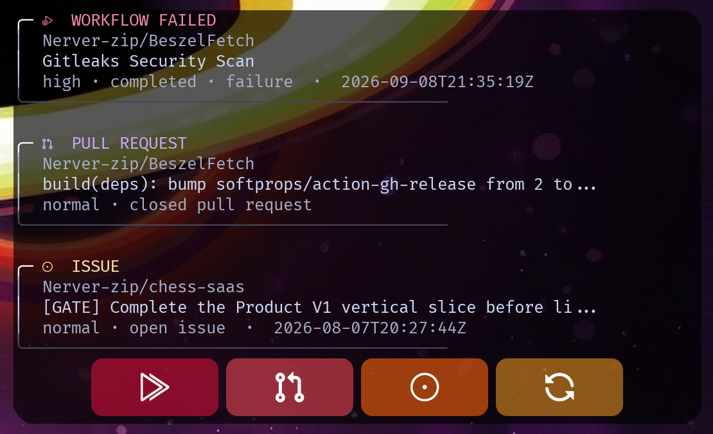

# ghinfo

[](https://github.com/Nerver-zip/ghinfo/actions/workflows/ci.yml)
[](https://github.com/Nerver-zip/ghinfo/actions/workflows/docker.yml)
[](https://en.cppreference.com/w/cpp/23)
[](https://cmake.org/)
[](https://curl.se/libcurl/)
[](https://www.docker.com/)
[](LICENSE)

`ghinfo` is a small, self-hosted service that turns GitHub activity into a
stable read-only JSON API. It polls GitHub in the background, normalizes
repositories, issues, pull requests, workflow runs, and jobs, then publishes
an immutable snapshot for any consumer: widgets, dashboards, scripts, or
internal tools.

The service owns GitHub authentication. Consumers only receive the normalized
HTTP response and never need access to the GitHub token.

## Highlights

- C++23 daemon with a small runtime footprint.
- Background polling independent from HTTP requests.
- Automatic discovery or explicit repository selection.
- Stable, versioned JSON instead of raw GitHub payloads.
- Last-known-good snapshot preserved during transient failures.
- Prioritized activity projection with deterministic ordering.
- Separate views for workflows, pull requests, and issues.
- Bounded workflow and job history with recent failed-job visibility.
- Non-root Docker image and read-only operation.
- No database, broker, webhook, or consumer-specific backend logic.

## How it works

```text
GitHub REST API
       │
       │ authenticated polling
       ▼
┌─────────────────────────────────┐
│             ghinfo              │
│  GitHub client → background poll│
│                    │            │
│                    ▼            │
│          immutable snapshot     │
│                    │            │
│                    ▼            │
│             read-only HTTP API  │
└─────────────────────────────────┘
       │
       ▼
  widgets · scripts · dashboards
```

HTTP handlers only read the latest snapshot. They never make synchronous
requests to GitHub and never mutate or consume activity items.

## Quick start

### Requirements

- CMake 3.25 or newer
- C++23 compiler (GCC 13+ or Clang 17+ recommended)
- libcurl development package
- Git

On Arch Linux:

```bash
sudo pacman -S --needed base-devel cmake ninja curl clang
```

On Debian or Ubuntu:

```bash
sudo apt-get install -y build-essential cmake ninja-build \
  libcurl4-openssl-dev clang-format
```

### Build and run

```bash
cp .env.example .env
```

Set the token and repository scope in `.env`:

```dotenv
GHINFO_GITHUB_TOKEN=github_pat_...
GHINFO_REPOSITORIES=auto
```

Then build and start the service:

```bash
cmake --preset dev
cmake --build --preset dev
./build/dev/ghinfo
```

The HTTP server listens on `127.0.0.1:8080` by default. The first snapshot is
built in the background; `/readyz` becomes available after that poll succeeds.

### Docker Compose

```bash
docker compose up --build -d
curl -fsS http://127.0.0.1:8080/readyz
```

For access from another machine, configure:

```dotenv
GHINFO_BIND=0.0.0.0
GHINFO_PORT=8080
```

The runtime image runs as the unprivileged `ghinfo` user. See
[`docs/RELEASE.md`](docs/RELEASE.md) for image and release procedures.

## Configuration

| Variable                       | Required | Default     | Description                                   |
| ------------------------------ |:--------:| -----------:| --------------------------------------------- |
| `GHINFO_GITHUB_TOKEN`          | yes      | —           | Fine-grained GitHub PAT                       |
| `GHINFO_REPOSITORIES`          | yes      | —           | `auto` or comma-separated `owner/repo` values |
| `GHINFO_POLL_INTERVAL_SECONDS` | no       | `60`        | Base polling interval                         |
| `GHINFO_BIND`                  | no       | `127.0.0.1` | HTTP bind address                             |
| `GHINFO_PORT`                  | no       | `8080`      | HTTP port                                     |
| `GHINFO_LOG_LEVEL`             | no       | `info`      | `trace`, `debug`, `info`, `warn`, or `error`  |
| `GHINFO_RUN_HISTORY`           | no       | `20`        | Recent workflow runs retained per repository  |
| `GHINFO_JOB_RUN_HISTORY`       | no       | `10`        | Recent workflow runs whose jobs are expanded  |

With `GHINFO_REPOSITORIES=auto`, repositories accessible to the authenticated
user are discovered and refreshed on every polling cycle.

## GitHub permissions

Create a fine-grained PAT limited to the repositories that should be observed,
with read access to:

- Metadata
- Issues
- Pull requests
- Actions

The token stays in the server environment. Never put it in Kustom, a widget,
the repository, or a client request. `.env` is ignored by Git.

## HTTP API

All data endpoints return normalized JSON and respond with
`503 snapshot_unavailable` until the first complete poll succeeds.

| Endpoint                       | Purpose                                             |
| ------------------------------ | --------------------------------------------------- |
| `GET /healthz`                 | Process health check                                |
| `GET /readyz`                  | Snapshot readiness check                            |
| `GET /v1/meta`                 | Schema, generation, polling, and rate-limit state   |
| `GET /v1/summary`              | Repository, issue, pull-request, and Actions counts |
| `GET /v1/repos`                | Repositories in the current snapshot                |
| `GET /v1/repos/{owner}/{repo}` | One repository and its normalized resources         |
| `GET /v1/issues`               | Open issues; supports `?repo=owner/name`            |
| `GET /v1/pulls`                | Open pull requests; supports `?repo=owner/name`     |
| `GET /v1/runs`                 | Retained workflow runs and status filters           |
| `GET /v1/jobs`                 | Jobs in the bounded expansion window                |
| `GET /v1/activity`             | Prioritized, diversified activity projection        |

### Activity views

The default activity view is the main current-state photograph:

```text
GET /v1/activity?limit=3
```

Independent category views are available for widgets with separate controls:

```text
GET /v1/activity?category=workflows&limit=3
GET /v1/activity?category=pull_requests&limit=3
GET /v1/activity?category=issues&limit=3
```

The default limit is `20`, and the maximum is `100`. Items include explicit
priority and signal fields, titles for issues and pull requests, names for
workflows and jobs, UTC timestamps, stable IDs, and URLs.
Currently running workflows and jobs take precedence over failed activity in
the default ordering.

When there are no open pull requests, the activity view may include a bounded
fallback of recently updated closed pull requests. The `/v1/pulls` endpoint,
summary, and grouped activity fields remain open-only.

## Kustom widget

The repository includes a paste-ready Kustom text recipe in
[`Kustom/example.txt`](Kustom/example.txt) and a Catppuccin Mocha variant in
[`Kustom/catpuccin_example.txt`](Kustom/catpuccin_example.txt). Configure a
Kustom global named `ghinfo` with the response from
`GET /v1/activity?limit=3`.

For a complete ready-to-import widget, use
[`assets/ghinfo-kustom-widget.kwgt`](assets/ghinfo-kustom-widget.kwgt). Import
the file in Kustom and update the WebGet URLs if the ghinfo host is different.
The preset includes the widget layout, activity flows, text formatting,
Catppuccin colors, and the required font.



For setup details and troubleshooting, see [`Kustom/README.md`](Kustom/README.md).

## Development

Configure, build, test, and format-check locally:

```bash
./scripts/validate.sh
```

For memory and lifetime-sensitive changes:

```bash
cmake --preset asan
cmake --build --preset asan
ctest --preset asan --output-on-failure
```

The project keeps the public contract and design rationale in:

- [`docs/API.md`](docs/API.md)
- [`docs/ARCHITECTURE.md`](docs/ARCHITECTURE.md)
- [`docs/SECURITY.md`](docs/SECURITY.md)
- [`docs/TESTING.md`](docs/TESTING.md)
- [`docs/ROADMAP.md`](docs/ROADMAP.md)
- [`dev/PLAN.md`](dev/PLAN.md)

## Repository layout

```text
.
├── .github/workflows/   # CI, container, and release automation
├── include/ghinfo/      # public domain and service interfaces
├── src/                 # daemon implementation
├── tests/               # deterministic unit and integration tests
├── Kustom/              # optional Android widget recipes
├── assets/              # widget preset and preview image
├── docs/                # API, architecture, security, and ADRs
├── scripts/             # validation and development helpers
├── Dockerfile
├── compose.yaml
└── CMakePresets.json
```

## License

MIT. See [`LICENSE`](LICENSE).
